<a name="T_E57EFDE4"></a>
# <span style="color:rgb(213,80,0)">3次元点群の形式の1つであるe57ファイルについて</span>
<a name="beginToc"></a>
## 目次
[はじめに](#H_224B1F00)
 
[E57形式について](#H_FB6DCE81)
 
[姿勢情報について](#H_CD951FF8)
 
[回転と移動の行列について](#H_090F96CA)
 
[MATLABにて実践する](#H_EFA45E4C)
 
[補足](#H_CAE25AD8)
 
<a name="endToc"></a>
<a name="H_224B1F00"></a>
# はじめに

この記事はMATLAB/Simulink Advent Calendar 2023の9日目の記事として書かれています。


[https://qiita.com/advent-calendar/2023/matlab](https://qiita.com/advent-calendar/2023/matlab)


LiDARなどにより取得される3次元点群ファイルの有名なフォーマットにe57があります。


e57は、XML データ形式に基づいて点群や各種データを階層ツリー構造で格納します。米国試験材料協会 (ASTM) によって定められています。


例えば、Leica社のCycloneで点群をエキスポートするときや、iPhone LiDARのアプリである、Dot3Dで点群をエキスポートするときにE57形式を選択することができます。


以下の図は、Dot3Dで点群をエキスポートするときの様子です。一番下にE57があることがわかります。

<p style="text-align:left">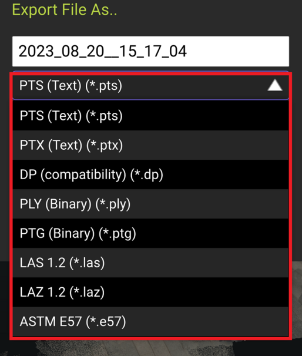</p>

<a name="H_FB6DCE81"></a>
# E57形式について

E57は、ヘッダー、バイナリーセクション、XMLセクションに分かれています。

<p style="text-align:left">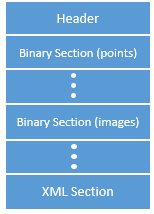</p>


**画像出典：e57FileReader**


https://jp.mathworks.com/help/lidar/ref/e57filereader.html


ヘッダーには、バージョン番号や、ファイルのフォーマットの名前などの情報が格納されています。


MATLABでE57形式の点群を読み込むと以下のようになります。

<p style="text-align:left">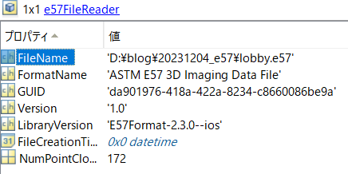</p>


また、データ構造は以下のようになっています。Dota3Dという3次元的なデータと、Images2Dとあるような2次元的なデータに分かれています。高密度点群の標準的なフォーマットであるLAS形式の違いとして、スキャンごとの点群やその点群を取得した時の位置や姿勢、また、画像に関する情報が分かれていることが挙げられます。


LAS形式では、スキャンごとの点群は合成され、また、各点にRGBの色情報が投影された状態で保存されます。

<p style="text-align:left">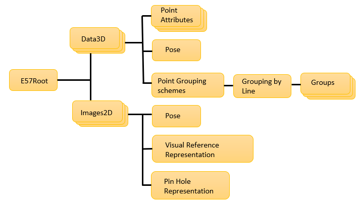</p>


**画像出典：e57FileReader**


https://jp.mathworks.com/help/lidar/ref/e57filereader.html


E57形式では、点群がスキャンごとに保存されるので、例えば以下のように2か所から計測した場合は、それぞれの点群とその時のスキャナの位置や向き、画像などが計測されます。

<p style="text-align:left">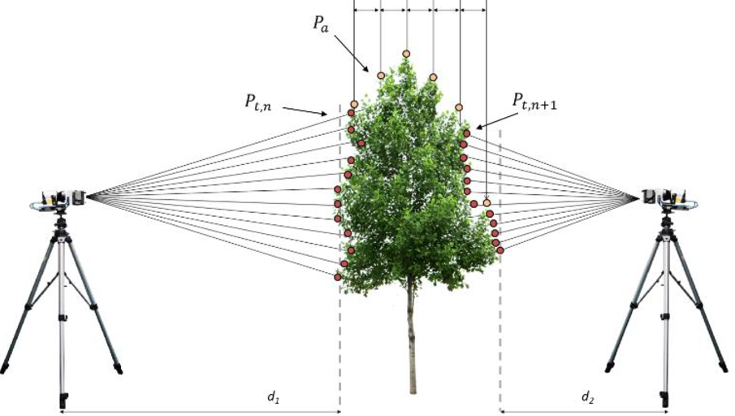</p>


**画像出典**：Paris, C., Kelbe, D., Van Aardt, J., & Bruzzone, L. (2017). A novel automatic method for the fusion of ALS and TLS LiDAR data for robust assessment of tree crown structure. *IEEE Transactions on Geoscience and Remote Sensing*, *55*(7), 3679-3693.


E57に関して、以下の記事がわかりやすかったです。


**Interoperability around the E57 Scanning Format**


https://www.cadinterop.com/en/formats/cloud-point/e57.html

<a name="H_CD951FF8"></a>
# 姿勢情報について

E57形式ではスキャンが行われた時の位置や向きが格納されていると述べました。


MATLABでE57形式の点群を読み込み、さらに、Data3Dから姿勢情報を読み取りました。


また、点群とその姿勢情報（スキャンしたときのデバイスの位置と向き）を可視化しています。


表示における技術的な内容や、MATLABでのコーデイング方法については後述しています。


なお、このE57形式の点群は、iPhone LiDARのアプリである、Dot3Dを利用して取得されました。


Dot3Dを利用したスキャンの方法やエキスポートの方法については以下の記事をご覧ください。


https://kentapt.hatenablog.com/entry/2023/08/21/234716


デバイスの位置と向きはカメラのアイコンで示しています。iPhone LiDARのデータであるため


スキャンしたポイントが多く、たくさんのカメラのアイコンが表示されています。

<p style="text-align:left">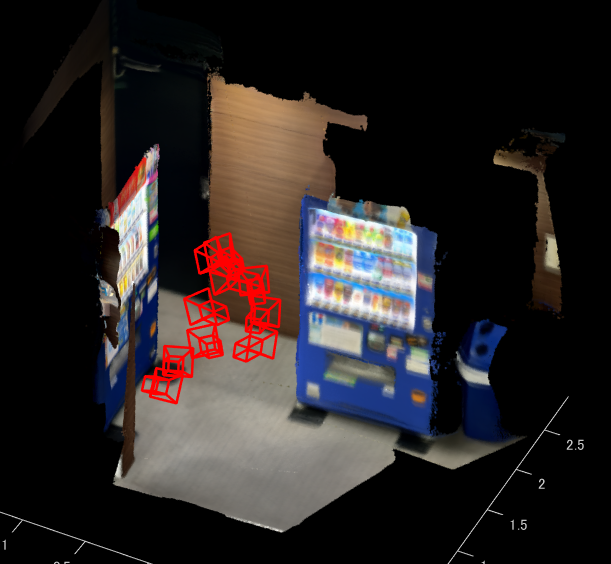</p>


近くで見ると、オレンジの枠で囲われた場所では、奥の自動販売機をスキャンしていて、


青色の場所では右側の自動販売機をスキャンしていることがわかります。

<p style="text-align:left">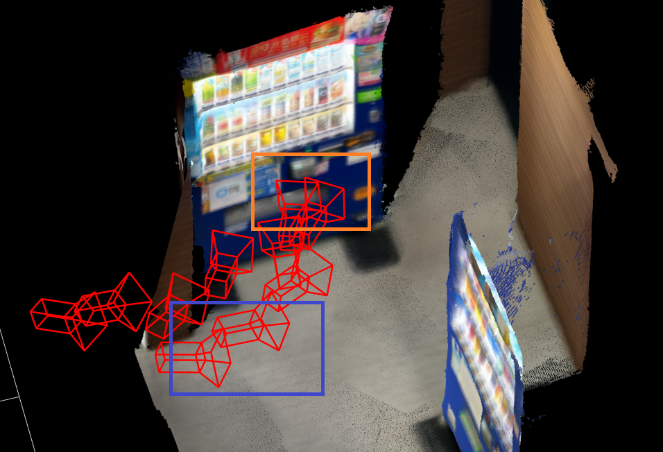</p>


このように、それぞれスキャンされた点群とその位置や姿勢がわかるため、それらをつなぎ合わせることで、


1つの高密度な点群を合成することができます。


例えば、以下の画像では、3つのスキャンのみをランダムに取り出して、その姿勢情報を利用して変換することでうまくつなぎ合わせています。


赤色は自動販売機、青色は天井、緑はエレベーターをそれぞれスキャンしていることがわかります。


このような操作をE57形式の点群に含まれるすべての点群に対して繰り返すことで、スキャン全体の点群を得られます。

<p style="text-align:left">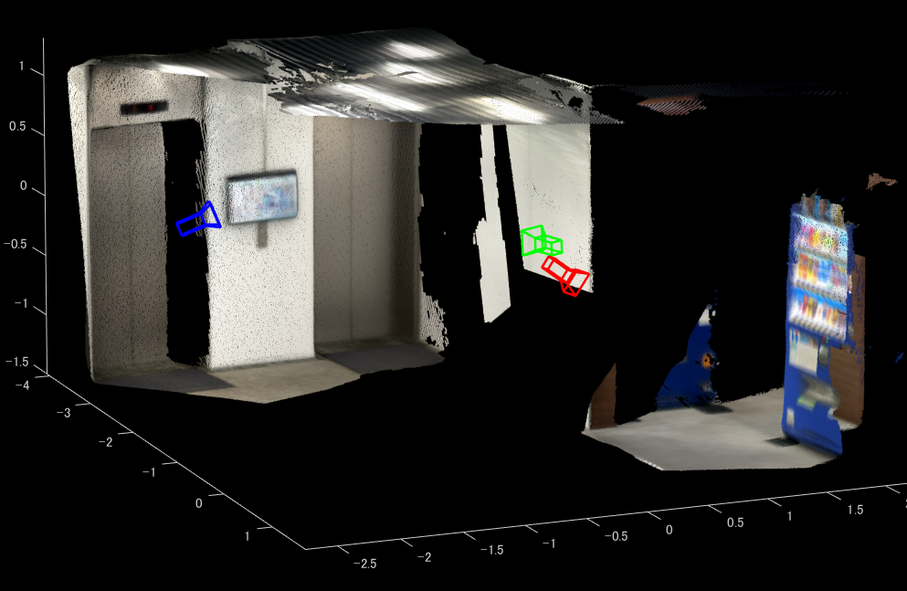</p>


以下の動画は、iPhone LiDARにより取得された点群をスキャンごとに取り出し、さらにその時の位置とiPhoneの姿勢の情報を利用して重ね合わせています。


最終的に生成されたデータをアプリ上ではエキスポートすることができます。

<p style="text-align:left">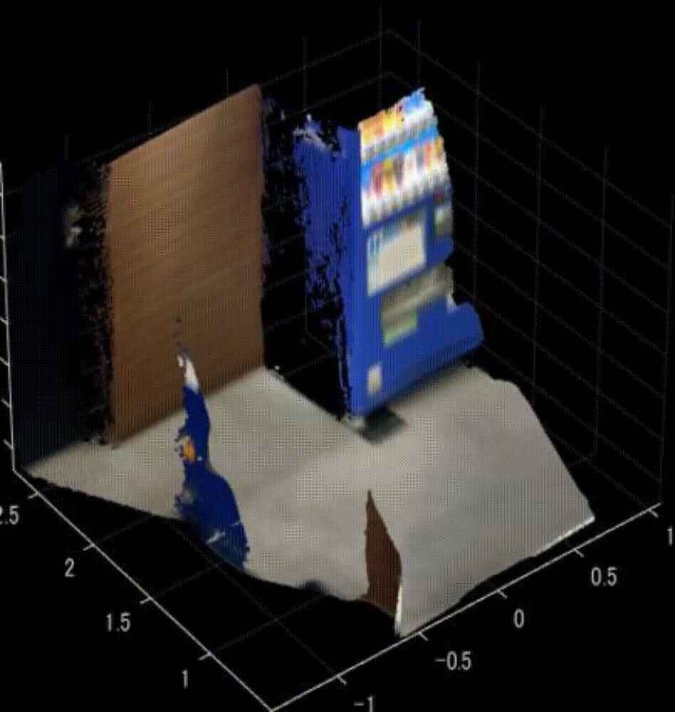</p>

<a name="H_090F96CA"></a>
# 回転と移動の行列について

E57ファイルには、スキャンした時のデバイスの位置や向きが格納されていますが、その表し方について説明します。


以下の図は2つのカメラの位置関係を示しています。この時、左のカメラの位置を基準として、右のカメラの位置を示すことを考えます。カメラを回転させる行列と平行移動させる行列があればそれを実現することができます。

<p style="text-align:left">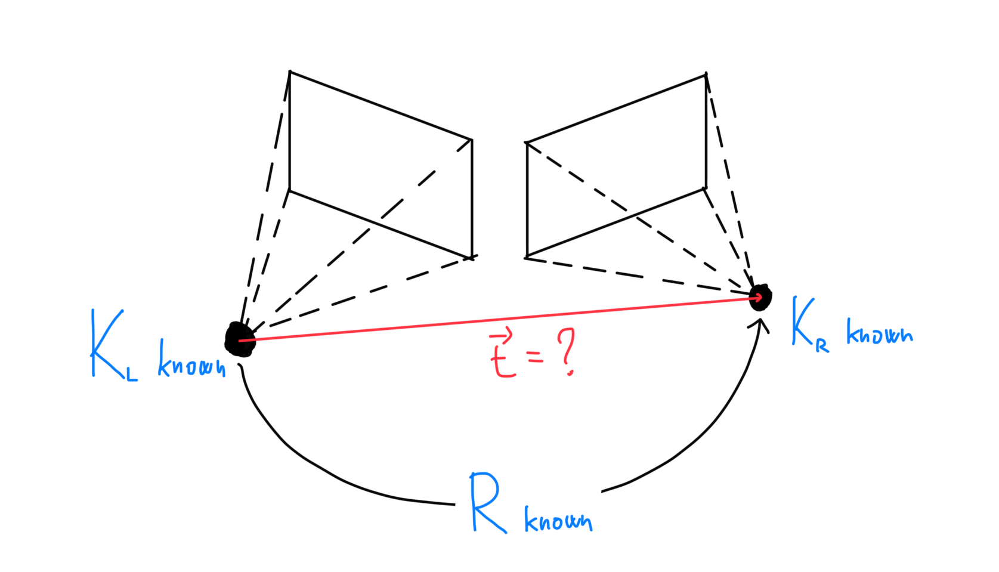</p>


**画像出典**：https://stackoverflow.com/questions/45195585/how-to-estimate-camera-translation-given-relative-rotation-and-intrinsic-matrix


回転行列は3次元上で行うと3×3になり、平行移動は3×1です。それらを合わせると以下のような行列になります。

<p style="text-align:left">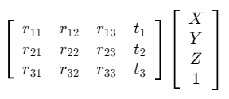</p>


<a name="H_EFA45E4C"></a>
# MATLABにて実践する

それでは、実際に上記の作業を行ってみます。


ポイントとして、以下のことが挙げられます。

-  <samp>e57FileReader</samp> と <samp>readPointCloud</samp> で、E57形式の点群を読み込む 
-  pcMetadataにある、RelativePoseから姿勢情報の行列を取得する 
-  行列の情報をもとに、点群を変換する 
-  行列の情報をもとにデバイスの位置と向きを可視化する 

また、ここでのサンプルファイルを以下に格納しています。適宜ダウンロードしてお使いください。


[https://drive.google.com/file/d/1Ym1e2t5u6vcMlrsblqmGA3Q7RNi54mZp/view?usp=sharing](https://drive.google.com/file/d/1Ym1e2t5u6vcMlrsblqmGA3Q7RNi54mZp/view?usp=sharing)


```matlab
clear;clc;close all
% e57ファイルから点群データを読み込むためのe57Readerオブジェクトを作成します。
e57Reader = e57FileReader("lobby.e57");

% 点群データ（ptCloudArr）および対応する姿勢（tformArr）を格納するための変数を初期化します。
ptCloudArr = [];
tformArr = []; 

% 点群データを読み取ります。
for i = 1:e57Reader.NumPointClouds
    % e57ファイルからi番目のフレームの点群データ（ptCloud）とメタデータ（pcMetadata）を読み込みます。
    [ptCloud, pcMetadata] = readPointCloud(e57Reader, i);
    
    % 各点群データと対応する姿勢をそれぞれの配列に追加します。
    for j = 1:numel(ptCloud)
        ptCloudArr = [ptCloudArr ptCloud(j)];
        tformArr = [tformArr pcMetadata.RelativePose];
        
        % 相対姿勢を用いてカメラをプロットします。
        cam = plotCamera(AbsolutePose=pcMetadata.RelativePose, Opacity=0, Size=0.1);
        hold on
    end
end

% 点群データと対応する姿勢を用いて点群の合成を行います。
pcMap = pcalign(ptCloudArr, tformArr); 

% 合成した点群を表示します。
figure;pcshow(pcMap)
```

<a name="H_CAE25AD8"></a>
# 補足

デバイスが3つだけ可視化された画像を作成するためのコードを示します。

```matlab
ptCloudArr = [];
tformArr = []; 
absTform   = rigidtform3d; 
% 点群データを読み取ります。
figure;
indices = [1 100 170];
colorList = {"red","blue","green"};
for ii = 1:3
   i = indices(ii);
   [ptCloud,pcMetadata] = readPointCloud(e57Reader,i);
    for j = 1:numel(ptCloud)
        ptCloudArr = [ptCloudArr ptCloud(j)];
        tformArr = [tformArr pcMetadata.RelativePose];
        color_i = colorList{ii};
        cam = plotCamera(AbsolutePose=pcMetadata.RelativePose,Opacity=0,Size=0.1,Color=color_i);hold on        
    end
end
pcMap = pcalign(ptCloudArr,tformArr); 
pcshow(pcMap)
```

<center>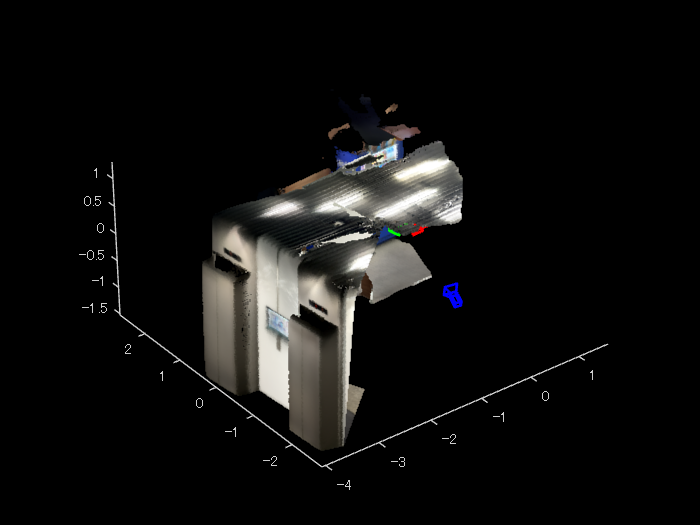</center>

